# Laporan Praktikum Modul 2 — DNS, Web Server, dan Reverse Proxy di GNS3

**Komdat Jarkom 2026 | Kelompok K-49 Grup C | Prefix IP: 10.88.x.x | Domain: K-49.com**

| Nama | NRP |
|---|---|
| Khalifa Suryadinarta | 5027251104 |
| Aura Syahzanani A | 5027251123 |

Semua skrip instalasi dan konfigurasi berada di `/root` pada masing-masing node. Salinannya ada di folder [`JarkomMod2/`](JarkomMod2/), dengan nama file yang sama seperti di node. Screenshot ada di folder [`screenshots/`](screenshots/).

## Daftar Isi
[Topologi dan alamat IP](#topologi-dan-alamat-ip) · [Urutan skrip](#urutan-menjalankan-skrip) · Nomor [1](#nomor-1---topologi-dan-alamat-ip) [2](#nomor-2---nat-dan-akses-internet) [3](#nomor-3---routing-internal-dan-resolver-awal) [4](#nomor-4---dns-master-prab-dan-slave-tedd) [5](#nomor-5---hostname-dan-a-record-tiap-node) [6](#nomor-6---zone-transfer-dan-serial) [7](#nomor-7---area-vault-area-core-dan-cname) [8](#nomor-8---reverse-zone-dan-ptr) [9](#nomor-9---web-statis-di-area-vault-apache) [10](#nomor-10---web-dinamis-di-area-core-nginx--php-fpm) [11](#nomor-11---reverse-proxy-penny-dan-abbey) [12](#nomor-12---basic-authentication-di-penny) [13](#nomor-13---redirect-ke-nama-kanonik) [14](#nomor-14---ip-asli-client-di-access-log) [15](#nomor-15---path-eternal-di-penny-dan-orion-di-abbey) [16](#nomor-16---benchmark-apachebench) [17](#nomor-17---txt-record) [18](#nomor-18---percobaan-ttl) [19](#nomor-19---cname-ke-domain-eksternal) [20](#nomor-20---autostart-setelah-restart) · [Kendala dan catatan](#kendala-dan-catatan)

* * *

## Topologi dan alamat IP

Router `rootkit` punya enam interface: `eth0` ke WAN (NAT, DHCP `192.168.122.x`) dan `eth1`–`eth5` ke lima segmen LAN. Node lain hanya punya satu interface `eth0`.

| Node | Peran | IP | Gateway |
|---|---|---|---|
| rootkit | router | eth0 DHCP; eth1 10.88.3.1; eth2 10.88.4.1; eth3 10.88.5.1; eth4 10.88.2.1; eth5 10.88.1.1 | — |
| alpha, beta, gamma | klien sayap kiri | 10.88.1.2 / .3 / .4 | 10.88.1.1 |
| delta, epsilon | klien sayap kanan | 10.88.2.2 / .3 | 10.88.2.1 |
| prab | DNS master (ns1) | 10.88.3.2 | 10.88.3.1 |
| tedd | DNS slave (ns2) | 10.88.3.3 | 10.88.3.1 |
| obladi, desmond | web statis (area **vault**) | 10.88.3.4 / .5 | 10.88.3.1 |
| oblada, molly | web dinamis (area **core**) | 10.88.3.6 / .7 | 10.88.3.1 |
| abbey | reverse proxy ke core (Nginx) | 10.88.4.2 | 10.88.4.1 |
| penny | reverse proxy ke vault (Apache) | 10.88.5.2 | 10.88.5.1 |

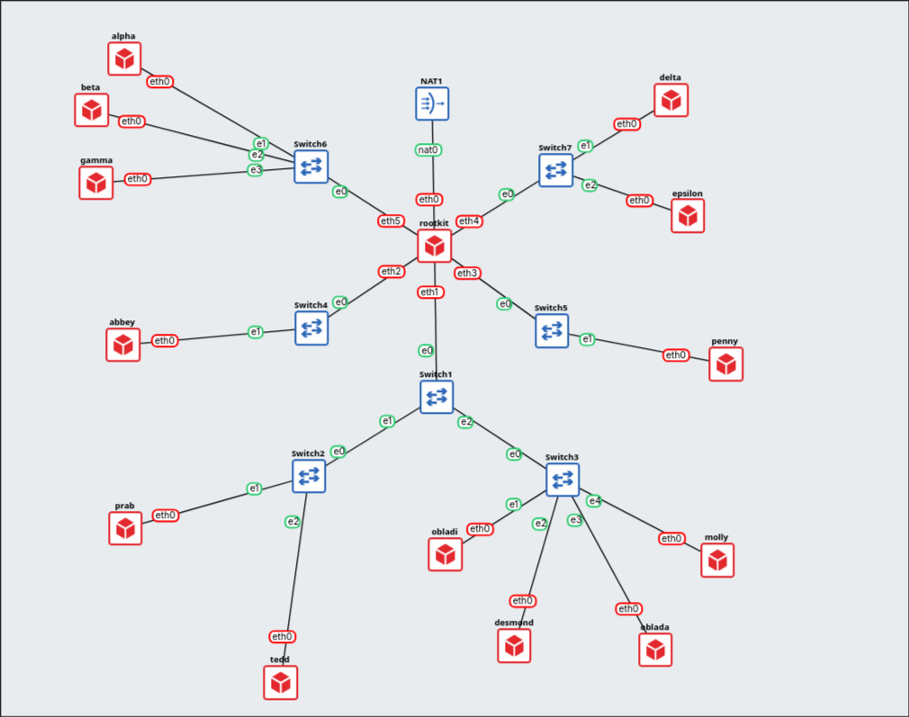

## Urutan menjalankan skrip

Skrip yang memakai `>>` atau `sed` pada nomor serial hanya boleh dijalankan **sekali**, sesuai urutan berikut (serial zona `K-49.com` naik mengikuti urutan ini).

| Urutan | Node | Skrip | Nomor |
|---|---|---|---|
| 1 | prab, tedd | `install_bind.sh` | 4 |
| 2 | prab | `config_prab.sh` | 4, 5 |
| 3 | tedd | `config_tedd.sh` | 4, 6 |
| 4 | prab | `soal7_prab.sh` | 7 |
| 5 | prab, lalu tedd | `soal8_prab.sh`, `soal8_tedd.sh` | 8 |
| 6 | obladi, desmond | `soal9.sh` | 9 |
| 7 | oblada, molly | `soal10.sh` | 10 |
| 8 | penny, abbey | `soal11_penny.sh`, `soal11_abbey.sh` | 11 |
| 9 | penny | `soal12_auth.sh` (dulu), lalu `soal12_penny.sh` | 12 |
| 10 | penny, abbey | `soal13_penny.sh`, `soal13_abbey.sh` | 13 |
| 11 | penny, obladi+desmond, oblada+molly | `soal14_penny.sh`, `soal14_vault.sh`, `soal14_core.sh` | 14 |
| 12 | penny, abbey | `soal15_penny.sh`, `soal15_abbey.sh` | 15 |
| 13 | alpha | `soal16_alpha.sh` (perlu `apache2-utils`) | 16 |
| 14 | prab | `soal17_prab.sh` | 17 |
| 15 | alpha, prab | `soal18_alpha_setup.sh`, lalu rantai `soal18_*` | 18 |
| 16 | prab | `soal19_prab.sh` | 19 |
| 17 | semua node server | `init.sh` + `soal20_*.sh` | 20 |

* * *

## Nomor 1 - Topologi dan alamat IP

**Yang diminta:** memberi IP dan default gateway ke semua node sesuai pembagian switch, memakai prefix kelompok.

**Cara:** konfigurasi jaringan tiap node diisi lewat *Edit config* di GNS3 (blok `iface eth0 inet static` berisi `address`, `netmask`, `gateway`). Konfigurasi ini tetap ada setelah node di-restart.

```
auto eth0
iface eth0 inet static
    address 10.88.4.2
    netmask 255.255.255.0
    gateway 10.88.4.1
```

**Pengujian** (di rootkit, alpha, delta):
```bash
ip -br -4 a
ip route | grep default
ping -c2 <gateway>
```


**Hasil:** rootkit menampilkan enam interface dengan IP `.1` di tiap segmen; alpha dan delta memakai IP dan gateway sesuai tabel, dan gateway dapat di-ping.

## Nomor 2 - NAT dan akses internet

**Yang diminta:** mengaktifkan jalur keluar lewat `eth0` rootkit dan NAT, sehingga semua host internal bisa menjangkau internet lewat alamat IP.

**Cara:** dua baris `up` di konfigurasi jaringan `eth0` rootkit (juga tetap ada setelah restart):
```
up sysctl -w net.ipv4.ip_forward=1
up iptables -t nat -A POSTROUTING -o eth0 -j MASQUERADE
```

**Pengujian:** di rootkit `sysctl net.ipv4.ip_forward` dan `iptables -t nat -S POSTROUTING`; di alpha `ping -c3 8.8.8.8`.


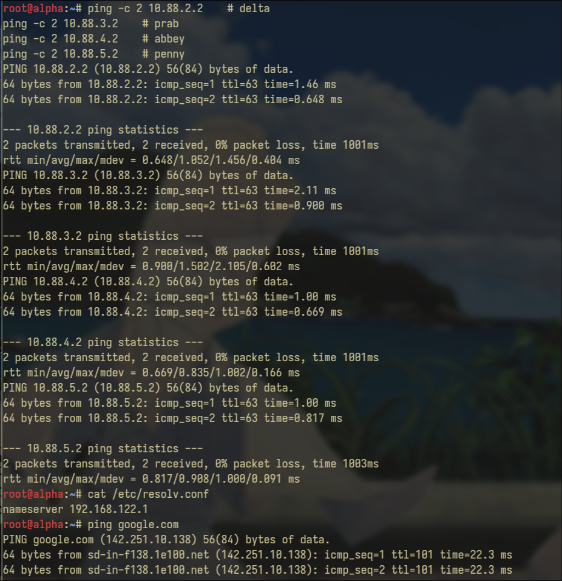

**Hasil:** `ip_forward = 1`, aturan `MASQUERADE` ada, dan alpha bisa ping `8.8.8.8` tanpa packet loss.

## Nomor 3 - Routing internal dan resolver awal

**Yang diminta:** semua node bisa saling berkomunikasi lewat rootkit, dan semua node non-router memakai resolver `192.168.122.1` sejak awal supaya bisa mengunduh paket.

**Cara:** baris `up echo "nameserver ..." > /etc/resolv.conf` di konfigurasi jaringan tiap node non-router. Setelah DNS internal jadi (nomor 4), urutannya menjadi prab, tedd, lalu `192.168.122.1`:
```
up echo "nameserver 10.88.3.2" > /etc/resolv.conf
up echo "nameserver 10.88.3.3" >> /etc/resolv.conf
up echo "nameserver 192.168.122.1" >> /etc/resolv.conf
```

**Pengujian** (di alpha dan delta): `cat /etc/resolv.conf`, ping ke semua node lain, dan `traceroute -n 10.88.2.2` dari alpha (sebaliknya dari delta).

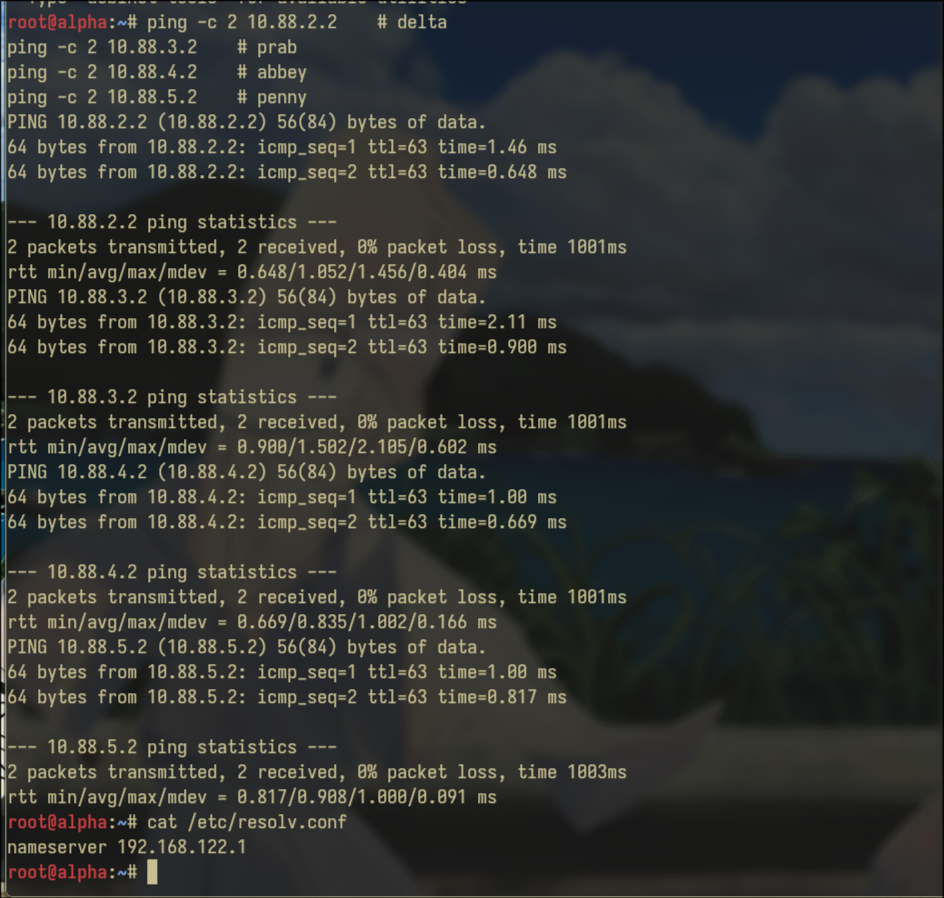


**Hasil:** semua target dapat dijangkau dan traceroute antar sayap melewati rootkit (`10.88.1.1` lalu tujuan, atau `10.88.2.1` lalu tujuan).

## Nomor 4 - DNS master (prab) dan slave (tedd)

**Yang diminta:** zona `K-49.com` authoritative di prab dengan SOA yang menunjuk `prab.K-49.com`, NS untuk prab dan tedd, A record prab, tedd dan apex (ke penny), `notify` dan `allow-transfer` ke tedd, serta forwarder ke `192.168.122.1`. Di tedd zona ditarik sebagai slave dan harus dijawab authoritative.

**Skrip:** `install_bind.sh` (prab, tedd), `config_prab.sh` (prab), `config_tedd.sh` (tedd).

Isi penting `config_prab.sh`: zona `type master` dengan `also-notify` dan `allow-transfer` ke `10.88.3.3`, file zona berisi SOA, dua NS, A untuk prab, tedd dan apex `10.88.5.2`, serta `forwarders { 192.168.122.1; }` di `named.conf.options`. `config_tedd.sh` mendeklarasikan zona `type slave` dengan `masters { 10.88.3.2; }`.

**Pengujian:**
```bash
named-checkconf                       # prab dan tedd
rndc zonestatus K-49.com              # primary di prab, secondary di tedd
dig +short NS K-49.com                # dari alpha, tanpa @
dig @10.88.3.2 K-49.com SOA +norecurse   # flag aa
dig @10.88.3.3 K-49.com SOA +norecurse   # flag aa
dig example.com                       # nama luar lewat forwarder
```

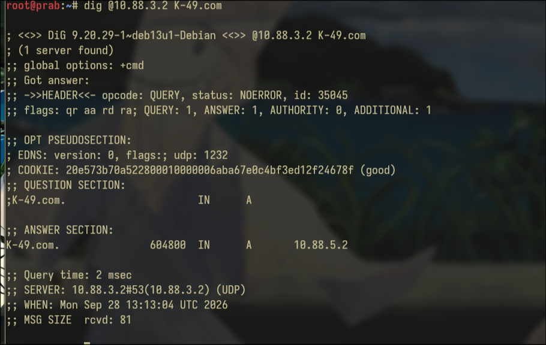
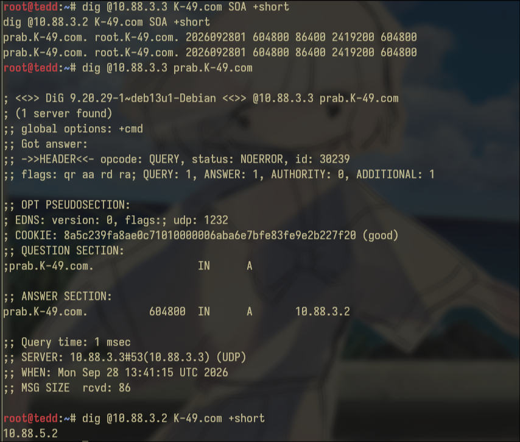
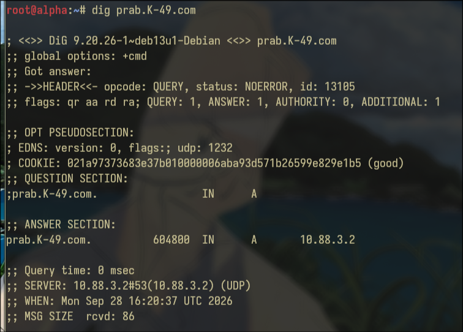
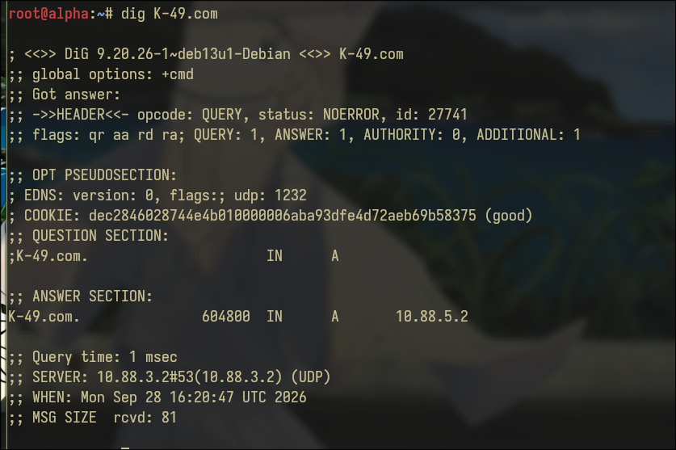

**Hasil:** prab berstatus `primary`, tedd `secondary`; kedua server menjawab dengan flag `aa`; NS menunjukkan prab dan tedd; apex menjawab `10.88.5.2`.

## Nomor 5 - Hostname dan A record tiap node

**Yang diminta:** memberi nama semua node sesuai glosarium, memastikan tiap host mengenali namanya, dan membuat A record `<node>.K-49.com` untuk semua node (prab dan tedd sudah dibuat di nomor 4).

**Cara:** A record untuk rootkit, alpha, beta, gamma, delta, epsilon, abbey, penny, obladi, desmond, oblada, dan molly ada di file zona pada `config_prab.sh`.

**Pengujian:** di tiap node `hostname` dan `hostname -f`; di klien
```bash
for n in rootkit alpha beta gamma delta epsilon prab tedd abbey penny obladi desmond oblada molly; do
  printf '%-8s -> %s\n' $n "$(dig +short $n.K-49.com)"; done
```

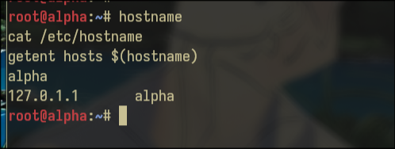

**Hasil:** keempat belas nama dikenali oleh host masing-masing dan ter-resolve ke IP yang benar; apex `K-49.com` menjawab `10.88.5.2`.

## Nomor 6 - Zone transfer dan serial

**Yang diminta:** memastikan tedd menerima salinan zona terbaru dari prab, dengan serial SOA yang sama.

**Pengujian:**
```bash
dig +short SOA K-49.com @10.88.3.2
dig +short SOA K-49.com @10.88.3.3
dig AXFR K-49.com @10.88.3.2          # dijalankan di tedd (satu-satunya yang diizinkan)
```

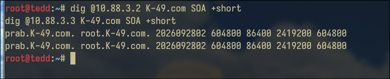

**Hasil:** serial di prab dan tedd sama (untuk zona forward maupun reverse) dan AXFR dari tedd berhasil.

## Nomor 7 - Area vault, area core, dan CNAME

**Yang diminta:** A record `vault.K-49.com` (obladi dan desmond) dan `core.K-49.com` (oblada dan molly), serta CNAME `www` ke penny dan `static` ke abbey; diverifikasi dari dua klien berbeda.

**Skrip:** `soal7_prab.sh` (menambahkan enam record dan menaikkan serial, lalu `named-checkzone` dan `rndc reload`).

**Pengujian** (dari alpha dan delta):
```bash
dig +short vault.K-49.com
dig +short core.K-49.com
dig +noall +answer www.K-49.com
dig +noall +answer static.K-49.com
```

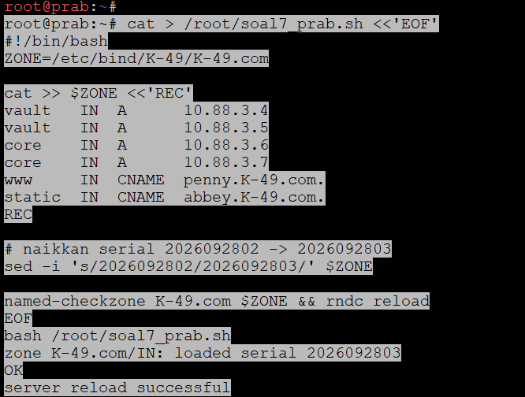
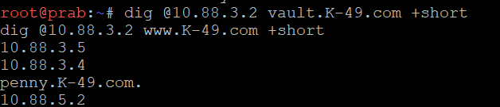
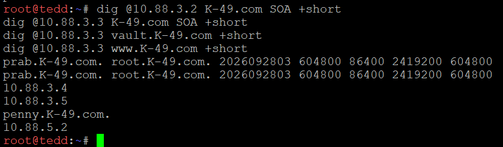
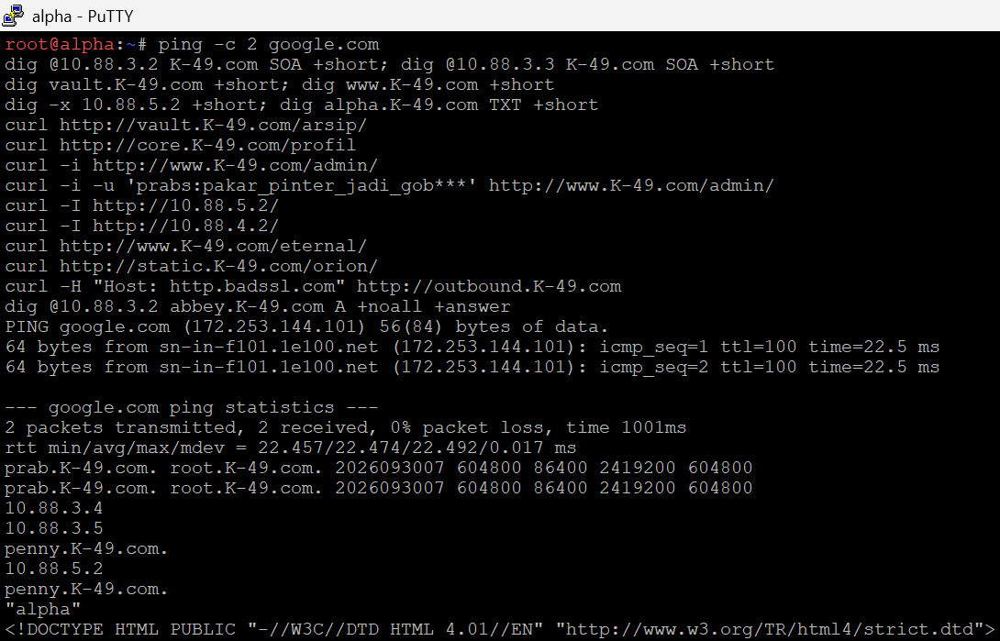

**Hasil:** vault menjawab dua IP (`10.88.3.4`, `10.88.3.5`), core menjawab dua IP (`10.88.3.6`, `10.88.3.7`), `www` beralias ke penny dan `static` ke abbey. Hasilnya sama dari alpha dan delta (screenshot dari alpha; delta diuji dengan perintah yang sama).

## Nomor 8 - Reverse zone dan PTR

**Yang diminta:** reverse zone untuk segmen abbey, penny, area vault, dan area core (master di prab, slave di tedd), PTR untuk keempat hostname, dan jawaban reverse yang authoritative.

**Cara:** keempat host berada di tiga segmen /24 berbeda (`10.88.3.x`, `10.88.4.x`, `10.88.5.x`), jadi kami memakai satu zona `88.10.in-addr.arpa` yang mencakup seluruh /16. Nama PTR memakai dua oktet terakhir, misalnya `2.4` untuk `10.88.4.2`.

**Skrip:** `soal8_prab.sh` (master) dan `soal8_tedd.sh` (slave).

**Pengujian:**
```bash
dig +short -x 10.88.4.2 ; dig +short -x 10.88.5.2 ; dig +short -x 10.88.3.4 ; dig +short -x 10.88.3.6
dig @10.88.3.3 -x 10.88.4.2 +norecurse      # flag aa
dig @10.88.3.2 -x 10.88.4.2 +norecurse
```

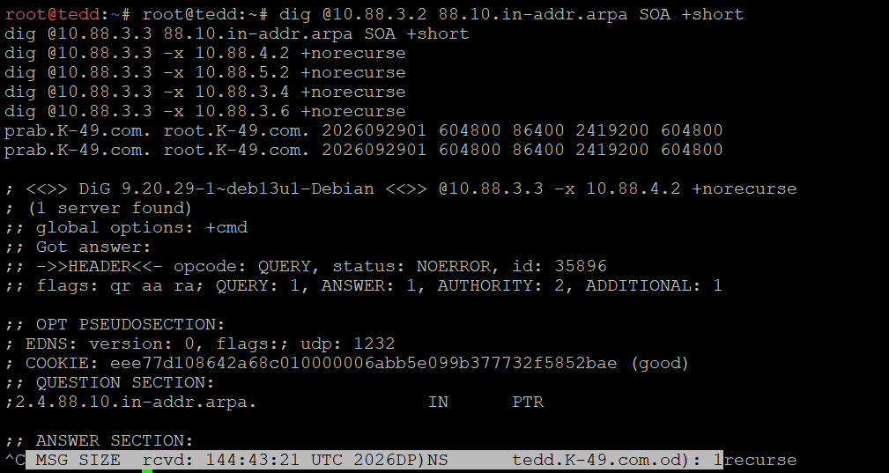

**Hasil:** PTR mengembalikan `abbey`, `penny`, `vault` (untuk kedua IP vault), dan `core` (untuk kedua IP core); jawaban dari tedd dan prab memakai flag `aa`.

## Nomor 9 - Web statis di area vault (Apache)

**Yang diminta:** Apache di obladi dan desmond, folder `/arsip/` dengan directory listing aktif, diuji lewat hostname (bukan IP).

**Skrip:** `soal9.sh` (memasang `apache2`, membuat `/var/www/html/arsip/` beserta dua file contoh, dan menambah `Options +Indexes` untuk direktori itu lewat `conf-available/arsip.conf`).

**Pengujian** (dari alpha dan delta):
```bash
curl -si http://obladi.K-49.com/arsip/  | egrep 'HTTP/|Index of|contoh'
curl -si http://desmond.K-49.com/arsip/ | egrep 'HTTP/|Index of|contoh'
curl -s  http://vault.K-49.com/arsip/contoh1.txt     # diulang beberapa kali
```

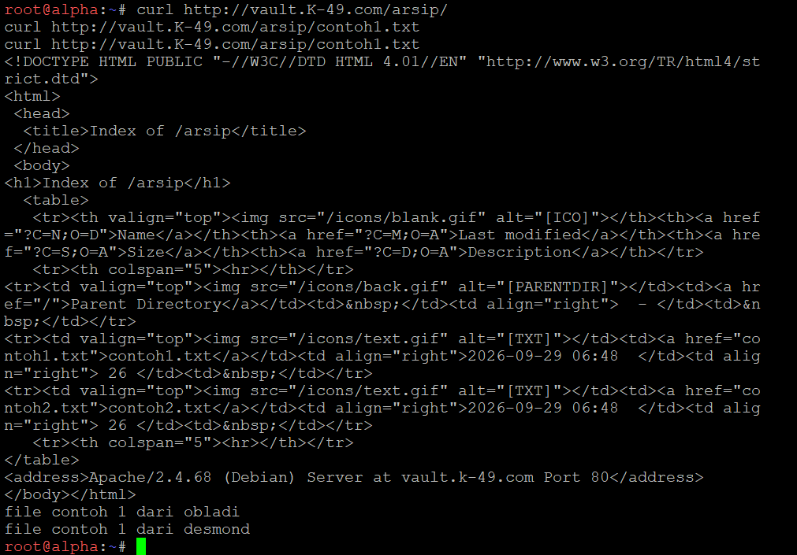
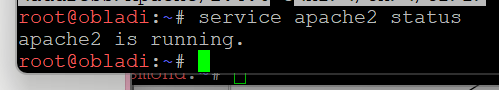
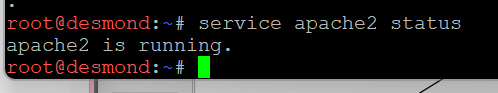

**Hasil:** kedua server menampilkan "Index of /arsip" dengan status 200. Isi file menyebut nama node yang melayani, dan `vault.K-49.com` bergantian antara obladi dan desmond.

## Nomor 10 - Web dinamis di area core (Nginx + PHP-FPM)

**Yang diminta:** Nginx dengan PHP-FPM di oblada dan molly, aplikasi sederhana dengan halaman beranda dan profil, dan URL bersih `/profil` (tanpa `.php`); diuji lewat hostname.

**Skrip:** `soal10.sh` (memasang `nginx` dan `php8.4-fpm`, membuat `index.php` dan `profil.php` di `/var/www/core`). Aturan rewrite di konfigurasi Nginx:
```nginx
rewrite ^/profil/?$ /profil.php last;
```

**Pengujian:**
```bash
curl -si http://oblada.K-49.com/ | egrep 'HTTP/|Beranda|Dilayani'
curl -si http://molly.K-49.com/profil | egrep 'HTTP/|Profil|Kelompok|Dilayani'
```

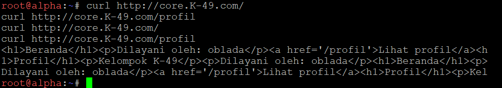
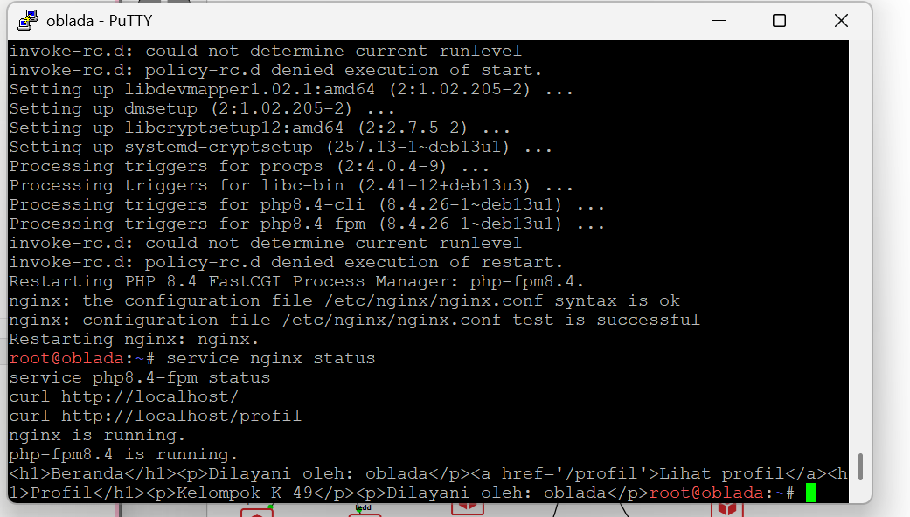
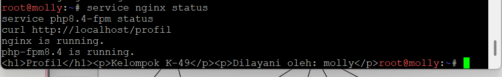

**Hasil:** beranda dan `/profil` menjawab 200 di kedua node, dan halaman menampilkan nama node yang melayani.

## Nomor 11 - Reverse proxy penny dan abbey

**Yang diminta:** penny (Apache) meneruskan ke semua node vault dan abbey (Nginx) ke semua node core, dengan meneruskan header `Host` dan `X-Real-IP`, dan trafik terbukti terbagi.

**Skrip:** `soal11_penny.sh`, `soal11_abbey.sh`.

- **penny:** `mod_proxy_balancer` dengan `BalancerMember` ke `10.88.3.4` dan `10.88.3.5` (`lbmethod=byrequests`), `ProxyPreserveHost On`, dan `RequestHeader set X-Real-IP`.
- **abbey:** blok `upstream core` berisi `10.88.3.6` dan `10.88.3.7`, dengan `proxy_set_header Host $host;` dan `proxy_set_header X-Real-IP $remote_addr;`.

**Pengujian:**
```bash
for i in 1 2 3 4; do curl -s http://www.K-49.com/arsip/contoh1.txt; done      # dari alpha
for i in 1 2 3 4 5 6; do curl -s http://static.K-49.com/profil | grep -o 'oleh: [a-z]*'; done
# di backend (obladi dan oblada), melihat header yang sampai:
timeout 20 tcpdump -l -i eth0 -A -s0 'tcp dst port 80 and src host <IP proxy>' 2>/dev/null | grep -a -o -E 'Host: [^ ]*|X-Real-IP: [^ ]*'
```

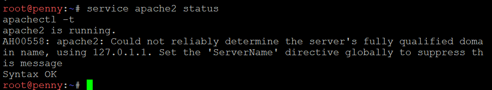
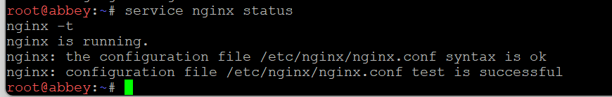
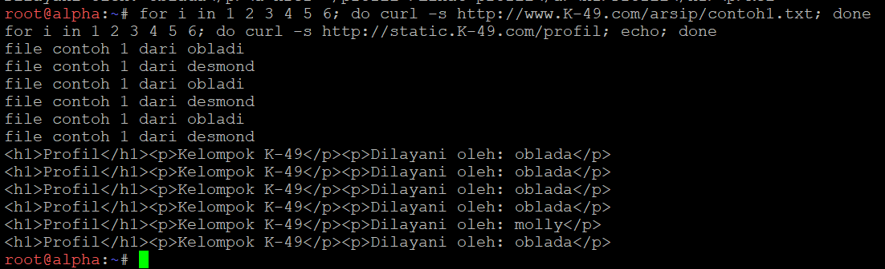

**Hasil:** penny bergantian antara obladi dan desmond; abbey memakai oblada dan molly (urutannya tidak selalu bergantian rapi karena Nginx punya penghitung per worker, tetapi kedua node terpakai). Di backend terlihat `Host` asli dan `X-Real-IP` dari proxy.

## Nomor 12 - Basic authentication di penny

**Yang diminta:** path `/admin` di penny dilindungi login: akses tanpa login ditolak, dan hanya user `prabs` (password sesuai ketentuan soal) yang boleh masuk.

**Skrip:** `soal12_auth.sh` (membuat file `/etc/apache2/.htpasswd` untuk user `prabs`) dijalankan lebih dulu, lalu `soal12_penny.sh`. `ProxyPass /admin !` mengecualikan `/admin` dari proxy, sehingga halamannya dilayani penny sendiri dari `/var/www/admin`, dengan `AuthType Basic` dan `Require valid-user`.

**Pengujian:**
```bash
curl -i http://www.K-49.com/admin/                                    # tanpa kredensial
curl -i -u 'prabs:<password>' http://www.K-49.com/admin/              # dengan kredensial
curl -s -o /dev/null -w '%{http_code}\n' -u prabs:salah http://www.K-49.com/admin/
```

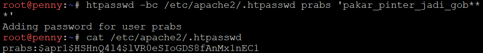
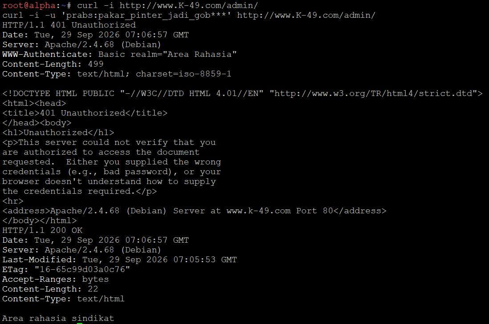

**Hasil:** tanpa kredensial dan dengan password salah, server menjawab `401 Unauthorized` beserta `WWW-Authenticate: Basic realm="Area Rahasia"`; dengan kredensial yang benar menjawab `200` dan isi "Area rahasia sindikat". Bagian lain situs tetap terbuka.

## Nomor 13 - Redirect ke nama kanonik

**Yang diminta:** akses ke IP penny atau `penny.K-49.com` diarahkan permanen (301) ke `www.K-49.com`; akses ke IP abbey atau `abbey.K-49.com` diarahkan sementara (302) ke `static.K-49.com`.

**Skrip:** `soal13_penny.sh`, `soal13_abbey.sh`.

- **penny:** virtual host pertama (`ServerName penny.K-49.com`) menjadi default untuk semua akses yang tidak cocok, termasuk lewat IP dan apex, dan berisi `Redirect permanent / http://www.K-49.com/`. Virtual host `www.K-49.com` menjadi nama kanonik.
- **abbey:** `server` dengan `default_server` berisi `return 302 http://static.K-49.com$request_uri;`, dan `server_name static.K-49.com` menjadi nama kanonik.

**Pengujian:**
```bash
curl -I http://10.88.5.2/          curl -I http://penny.K-49.com/
curl -I http://10.88.4.2/          curl -I http://abbey.K-49.com/
curl -I http://www.K-49.com/arsip/ curl -I http://static.K-49.com/profil
```

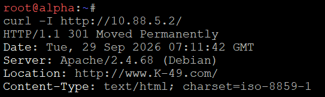
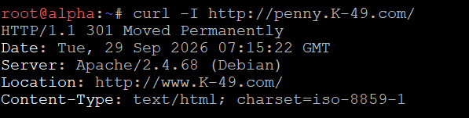
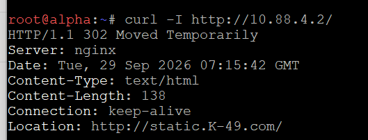
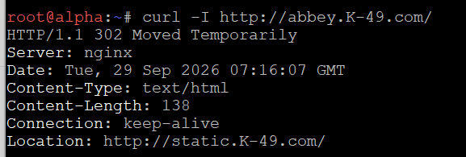
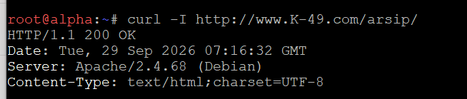
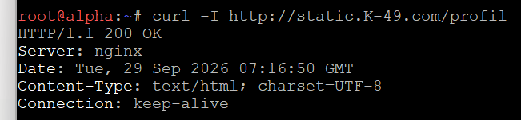

**Hasil:** IP dan nama penny menjawab `301` dengan `Location: http://www.K-49.com/`; IP dan nama abbey menjawab `302` ke `static.K-49.com`; nama kanonik menjawab `200` tanpa redirect.

## Nomor 14 - IP asli client di access log

**Yang diminta:** access log semua web server di area vault dan core harus mencatat IP asli pengunjung, bukan IP penny atau abbey.

**Skrip:** `soal14_penny.sh`, `soal14_vault.sh`, `soal14_core.sh`.

- **penny:** `RequestHeader set X-Real-IP expr=%{REMOTE_ADDR}`.
- **obladi, desmond:** modul `remoteip` dengan `RemoteIPHeader X-Real-IP` dan `RemoteIPInternalProxy 10.88.5.2`.
- **oblada, molly:** `set_real_ip_from 10.88.4.2;` dan `real_ip_header X-Real-IP;`.

**Pengujian:** dari alpha kirim beberapa request lewat `www.K-49.com` dan `static.K-49.com`, lalu di tiap backend:
```bash
grep 'tag=...' /var/log/apache2/access.log | awk '{print $1, $7}'     # obladi, desmond
grep 'tag=...' /var/log/nginx/access.log   | awk '{print $1, $7}'     # oblada, molly
```

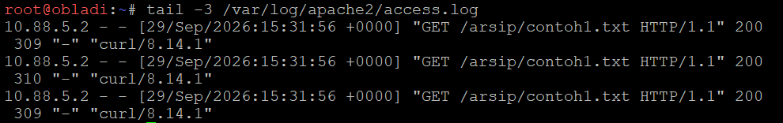
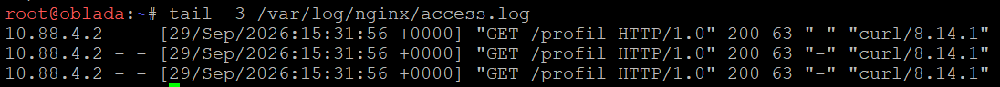
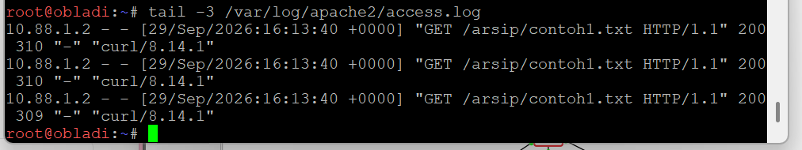
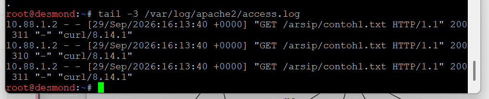
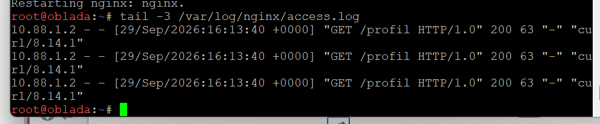
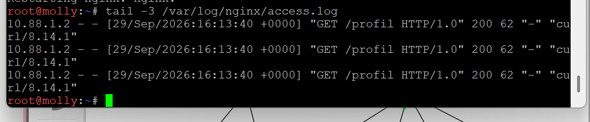

**Hasil:** sebelum konfigurasi, log vault mencatat `10.88.5.2` dan log core mencatat `10.88.4.2`. Sesudahnya, keempat backend (obladi, desmond, oblada, molly) mencatat `10.88.1.2`, yaitu IP alpha yang mengirim request.

## Nomor 15 - Path /eternal di penny dan /orion di abbey

**Yang diminta:** penny menyajikan `/var/www/eternal` lewat path `/eternal` dan file PHP-nya harus dijalankan; abbey menyajikan `/var/www/orion` lewat path `/orion` secara murni statis.

**Skrip:** `soal15_penny.sh`, `soal15_abbey.sh`.

- **penny:** `ProxyPass /eternal !` (tidak diteruskan ke vault), `Alias /eternal /var/www/eternal`, dan `SetHandler "proxy:unix:/run/php/php8.4-fpm.sock|fcgi://localhost"` untuk file `.php`, dengan paket `php8.4-fpm` terpasang di penny.
- **abbey:** `location /orion/ { alias /var/www/orion/; }` tanpa PHP. Ditambahkan juga `location = /orion { return 301 /orion/; }` supaya bentuk tanpa garis miring `/orion` juga bekerja (bagian ini ada di `soal20_abbey.sh`).

**Pengujian:**
```bash
curl -s http://www.K-49.com/eternal/            curl -s http://www.K-49.com/eternal/index.php
curl -s http://static.K-49.com/orion/           curl -sI http://static.K-49.com/orion
curl -s http://static.K-49.com/orion/tes.php     # berkas uji berisi <?php echo "php jalan"; ?>
```

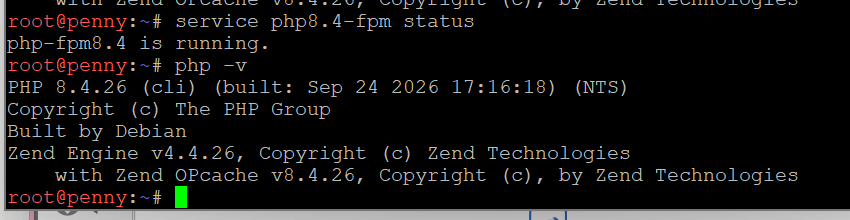
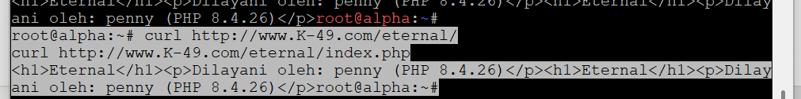
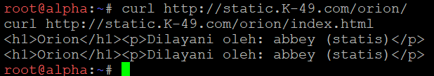
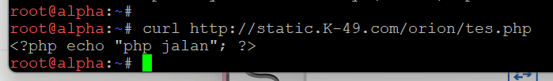

**Hasil:** `/eternal/` menampilkan "Dilayani oleh: penny (PHP 8.4.x)", artinya PHP dijalankan dan bukan tampil sebagai kode; `/orion/` menampilkan halaman statis dari abbey; `/orion` tanpa garis miring diarahkan (301) ke `/orion/`; file `.php` di abbey tidak dijalankan (`/orion/tes.php` tampil sebagai teks kode, bukan hasil eksekusi).

## Nomor 16 - Benchmark ApacheBench

**Yang diminta:** dari satu klien (alpha), 250 request dengan konkurensi 10 ke `www.K-49.com` dan `static.K-49.com`, lalu menampilkan ringkasannya.

**Skrip:** `soal16_alpha.sh` (perlu `apache2-utils`, yang menyediakan perintah `ab`).

```bash
ab -n 250 -c 10 http://www.K-49.com/
ab -l -n 250 -c 10 http://static.K-49.com/
```

Opsi `-l` dipakai untuk `static` karena halaman dari oblada dan molly berbeda satu byte (nama hostname ikut tertulis), dan abbey membagi request ke keduanya. Tanpa `-l`, ab menghitung setiap balasan yang panjangnya berbeda dari balasan pertama sebagai "gagal" (`Length`), padahal semua request menerima status 200.

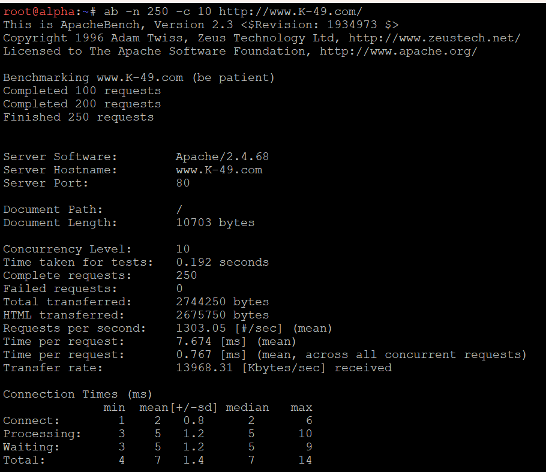
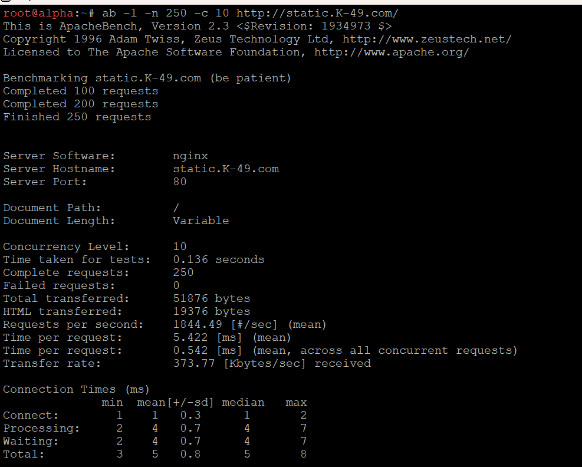

**Hasil:** kedua endpoint menyelesaikan 250 request tanpa kegagalan; lihat screenshot untuk `Requests per second` dan `Time per request`.

## Nomor 17 - TXT record

**Yang diminta:** TXT record untuk alpha, beta, gamma, delta, dan epsilon yang mengembalikan nama hostname masing-masing.

**Skrip:** `soal17_prab.sh` (menambah lima TXT record dan menaikkan serial).

```bash
for n in alpha beta gamma delta epsilon; do printf '%-8s -> ' $n; dig +short TXT $n.K-49.com; done
```

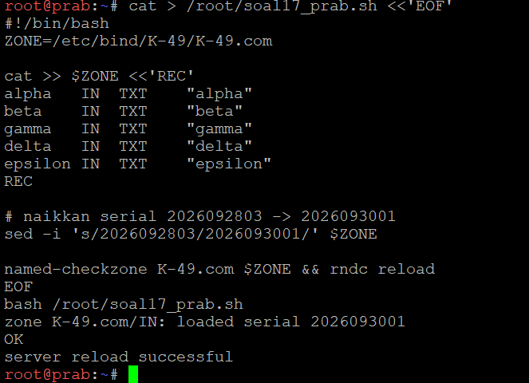
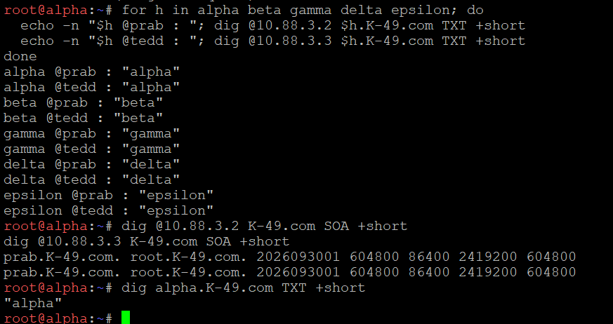

**Hasil:** tiap klien mengembalikan hostname-nya (misalnya `"alpha"`), dan serial di prab dan tedd sama.

## Nomor 18 - Percobaan TTL

**Yang diminta:** mengubah A record abbey ke IP fiktif, menaikkan serial dan memastikan tedd ikut sinkron, memasang TTL 15 detik, lalu memverifikasi tiga fase: sebelum perubahan (IP lama), sesaat setelah perubahan dalam jeda 15 detik (masih IP lama karena cache), dan setelah TTL habis (IP fiktif). Setelah itu semuanya dikembalikan ke normal.

**Cara:** alpha dijadikan resolver caching lokal (di `127.0.0.1`) yang meneruskan zona `K-49.com` ke prab, supaya efek cache terlihat lewat `dig @127.0.0.1`. Pada screenshot percobaan resolver ini dijalankan sebagai `unbound`; skrip `soal18_alpha_setup.sh` di repo ini memasang BIND untuk peran yang sama. IP fiktif yang dipakai: `203.0.113.77` (format valid). Rantai skrip di prab: `soal18_prab_ttl.sh`, `soal18_prab_change.sh`, `soal18_revert.sh`, `soal18_prab_ip.sh`, dan `soal18_revert_final.sh`. Skrip ini bergantung pada nomor serial yang tepat, jadi dijalankan berurutan dari serial `…01`, dan serial dicek sama di prab dan tedd setiap langkah.

**Pengujian:**
```bash
rndc zonestatus K-49.com | grep serial            # prab dan tedd, setiap langkah
dig abbey.K-49.com @127.0.0.1 +noall +answer      # di alpha: fase 1, 2, dan 3
```

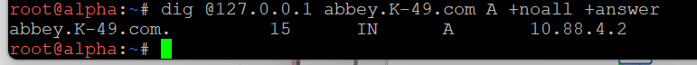
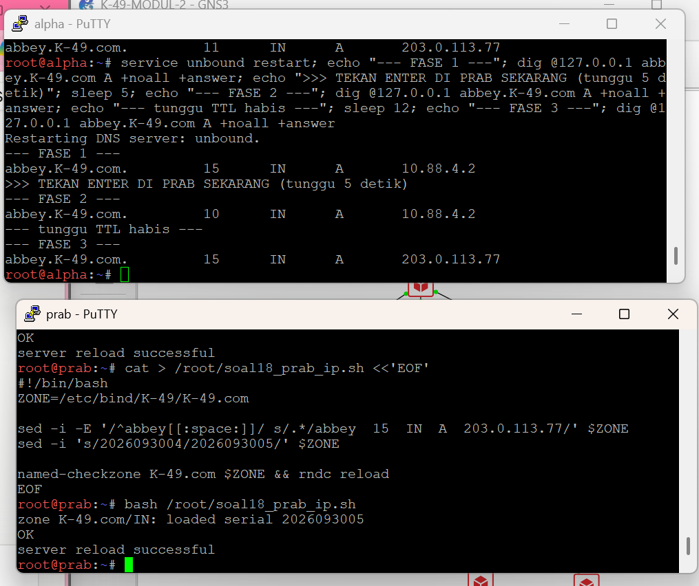
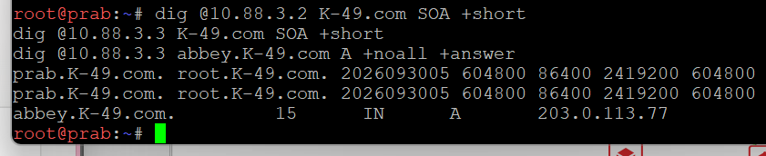
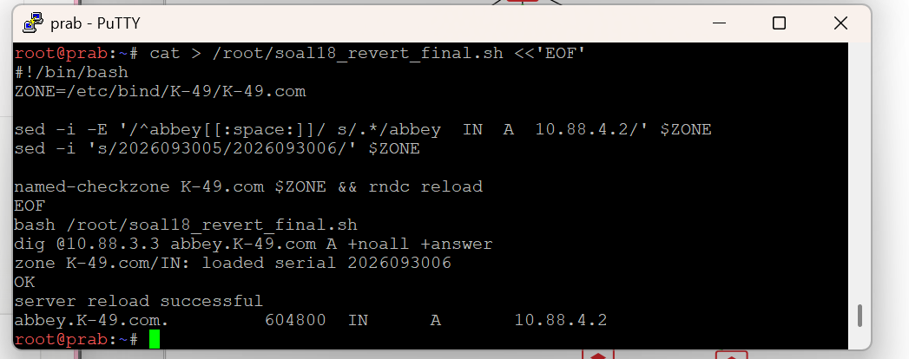

**Hasil:**

| Fase | Jawaban di alpha |
|---|---|
| 1. sebelum perubahan | `10.88.4.2` (TTL turun dari 15) |
| 2. dalam jeda 15 detik | tetap `10.88.4.2` (dari cache; TTL terus turun), sementara prab sudah menjawab `203.0.113.77` |
| 3. setelah TTL habis | `203.0.113.77` |

Sesudah percobaan, `abbey` dikembalikan ke `IN A 10.88.4.2` dengan TTL bawaan (604800) dan serial prab dan tedd sama. Kami memeriksa bahwa `static.K-49.com` dan semua layanan lain kembali normal.

## Nomor 19 - CNAME ke domain eksternal

**Yang diminta:** CNAME `outbound.K-49.com` ke `http.badssl.com`, dan `curl` ke `outbound.K-49.com` harus menghasilkan isi halaman `http.badssl.com`.

**Skrip:** `soal19_prab.sh` (menambah `outbound IN CNAME http.badssl.com.` dan menaikkan serial).

```bash
dig +noall +answer outbound.K-49.com
curl -s -H 'Host: http.badssl.com' http://outbound.K-49.com/ | md5sum
curl -s http://http.badssl.com/ | md5sum
```

`http.badssl.com` memilih halaman berdasarkan header `Host`. `curl` biasa ke `outbound.K-49.com` mengirim `Host: outbound.K-49.com`, sehingga server menampilkan halaman default nginx. Dengan header `Host: http.badssl.com`, isi yang diterima sama persis dengan halaman aslinya.

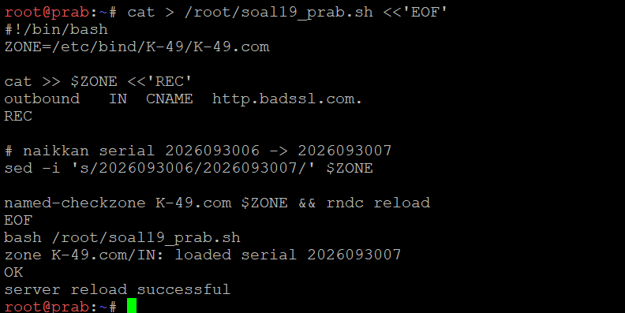
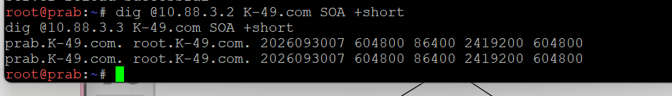
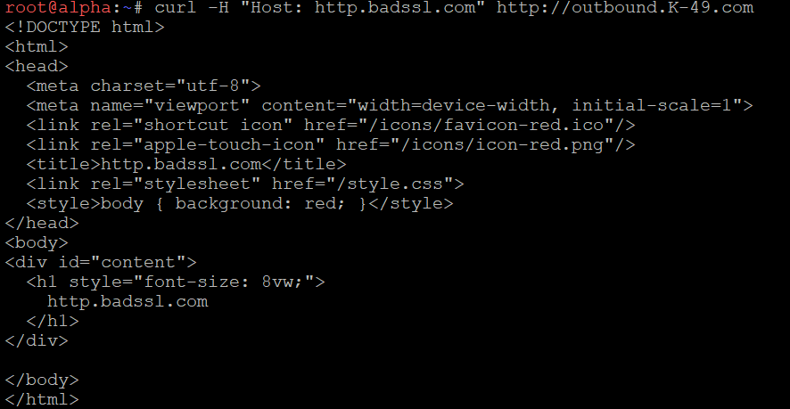

**Hasil:** CNAME ter-resolve ke `http.badssl.com` dan A record-nya; dengan header `Host` yang sesuai, output `curl` sama dengan halaman badssl (md5 identik).

## Nomor 20 - Autostart setelah restart

**Yang diminta:** setelah sebuah node di-restart, seluruh layanan dan konfigurasi yang sudah dibuat harus aktif lagi dengan sendirinya. Keadaan percobaan nomor 18 tidak dihitung; record abbey kembali normal.

**Cara:** ada tiga lapis.
1. **Konfigurasi jaringan GNS3** (IP, gateway, `resolv.conf`, NAT di rootkit) selalu ada setelah restart.
2. **`startup.sh`** di tiap node menulis resolver dan menjalankan layanan node itu; dipanggil lewat *Start command* node di GNS3 (`sh -c "bash /root/startup.sh; exec /bin/bash"`).
3. **`/root/init.sh`** dijalankan otomatis oleh `/etc/debinet-init.sh` di setiap start, lalu memanggil `/root/soal20_<peran>.sh` di latar belakang. Skrip itu memasang paket yang hilang, menulis ulang konfigurasi yang berbeda, dan menjalankan layanan yang mati; jika semuanya sudah ada, tidak ada yang diubah. Lognya di `/root/boot.log`. Dipasang di prab, tedd, obladi, desmond, oblada, molly, penny, dan abbey.

**Pengujian:** node di-stop lalu di-start dari GNS3, ditunggu sekitar satu sampai dua menit, lalu:
```bash
cat /root/boot.log        # diakhiri "done"
service <layanan> status  # bind9 / apache2 / nginx
```
dan bukti-bukti nomor sebelumnya dijalankan ulang dari alpha dan delta (SOA, vault, www, PTR, TXT, `/arsip/`, `/profil`, `/admin`, redirect, `/eternal/`, `/orion/`, outbound). `abbey.K-49.com` harus kembali `10.88.4.2` dengan TTL 604800.

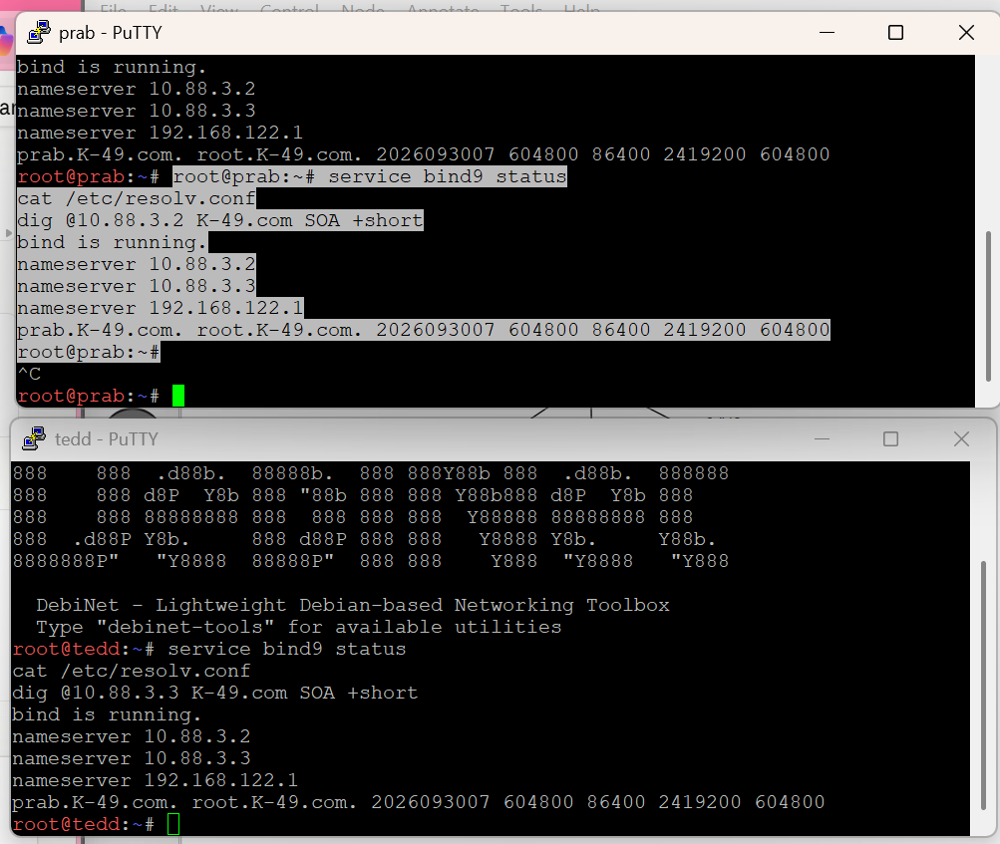
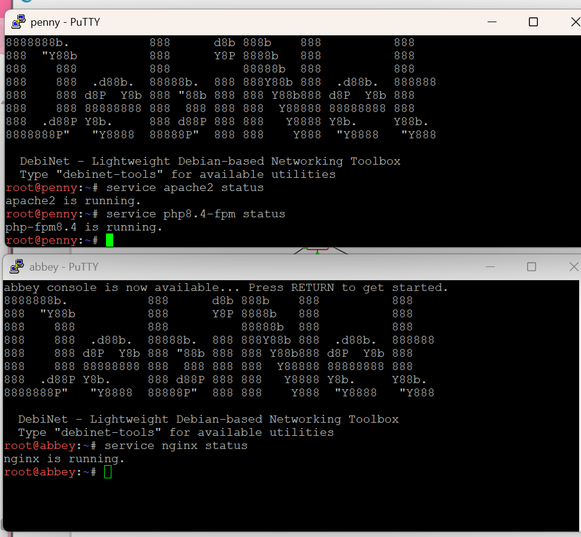
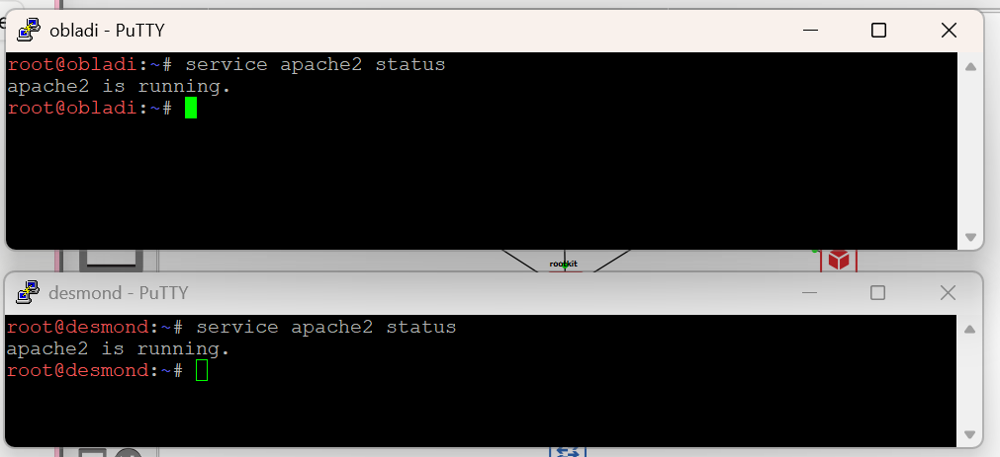
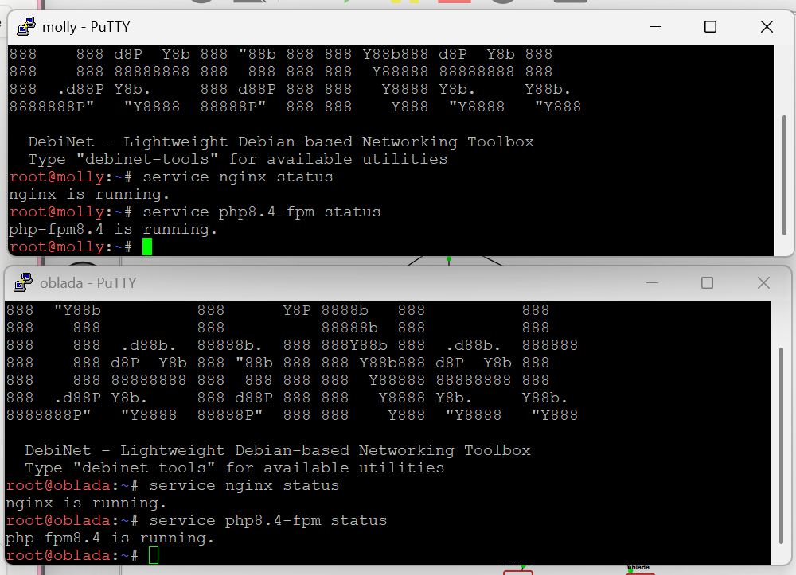
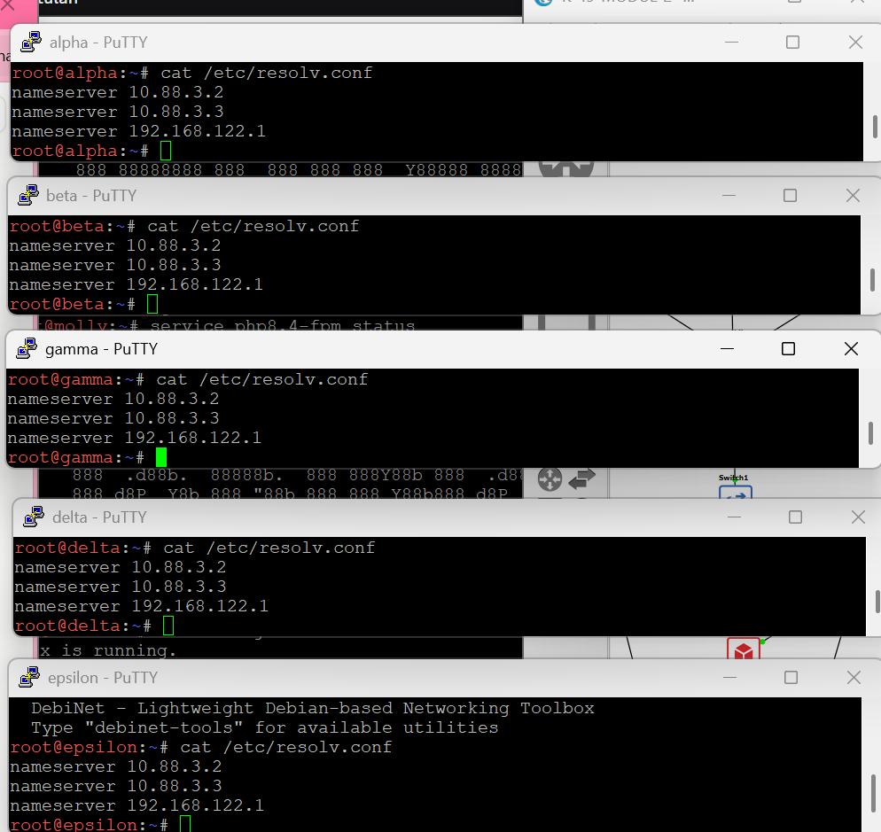
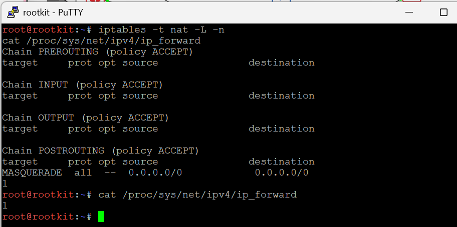
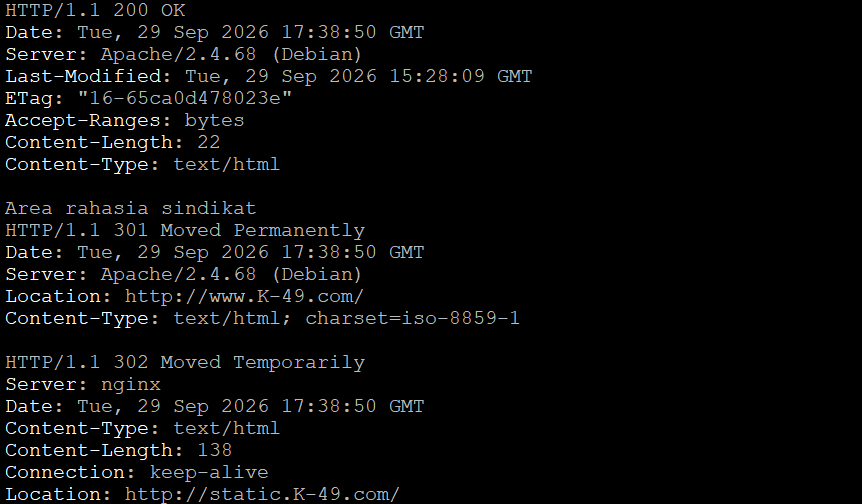
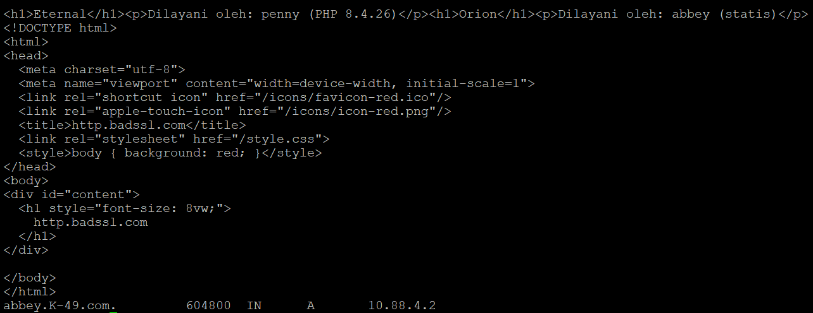
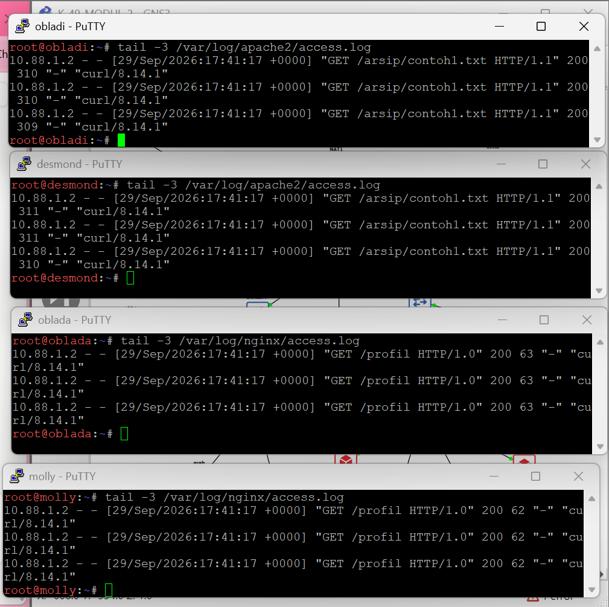

**Hasil:** layanan berjalan kembali tanpa perintah manual setelah restart.

* * *

## Kendala dan catatan

- **X-Real-IP di penny (nomor 11 dan 14):** versi awal `RequestHeader set X-Real-IP "%{REMOTE_ADDR}s"` mengirim nilai kosong (`(null)`) ke backend. Diperbaiki di nomor 14 dengan `expr=%{REMOTE_ADDR}`.
- **`ab` pada `static` (nomor 16):** tanpa `-l`, 125 dari 250 request dihitung gagal karena beda panjang halaman satu byte; bukan kegagalan sebenarnya.
- **Header Host pada nomor 19:** lihat penjelasan di nomor 19.
- **Skrip yang hanya boleh dijalankan sekali:** `soal7`, `soal15`, `soal17`, rantai `soal18`, dan `soal19` menambah record atau memakai `sed` pada serial tertentu; menjalankannya ulang di luar urutan membuat serial tidak naik dan tedd tidak menyalin perubahan.
- **Nomor 18 tidak diputar ulang** dari kondisi akhir karena rantai skripnya bergantung pada serial awal; buktinya adalah screenshot dari saat percobaan dilakukan.
